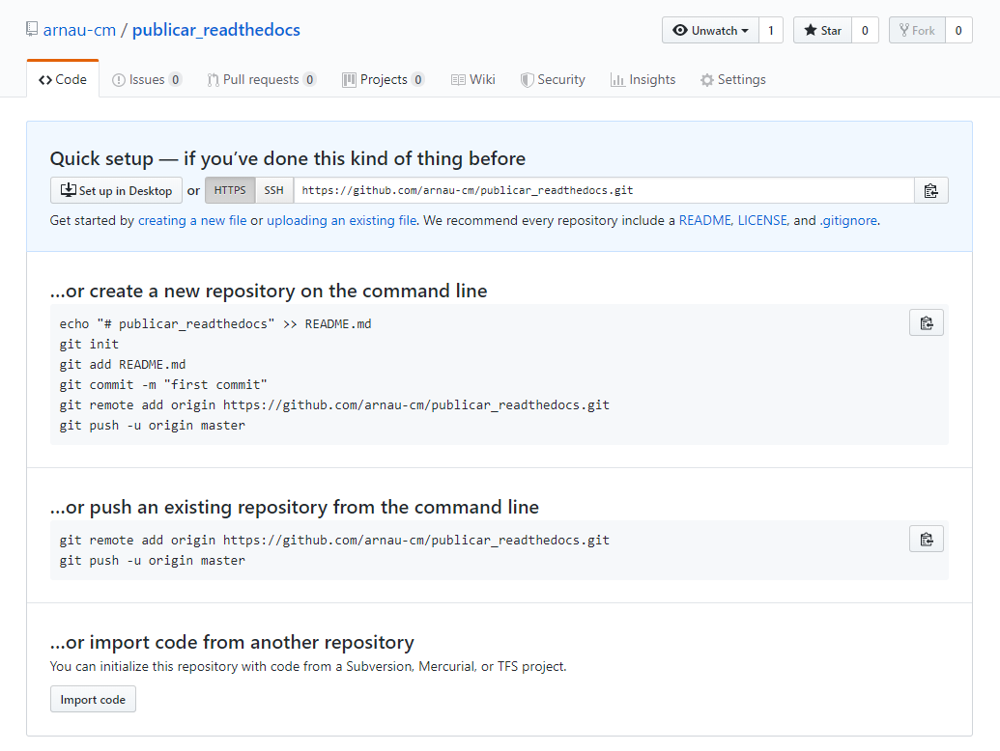
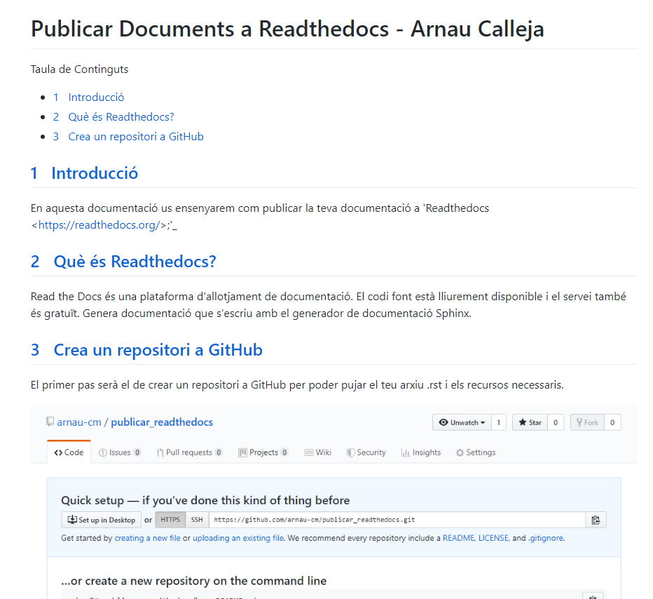

Publicar Documents a Readthedocs - Arnau Calleja
=========================================

.. sectnum::

.. contents:: Taula de Continguts

Introducció
~~~~~~~~~~~~~~~~~~~~~~~~~

En aquesta documentació us ensenyarem com publicar la teva documentació a 'Readthedocs <https://readthedocs.org/>;'_

Què és Readthedocs?
~~~~~~~~~~~~~~~~~~~~~~~~~

Read the Docs és una plataforma d'allotjament de documentació. El codi font està lliurement disponible i el servei també és gratuït. Genera documentació que s'escriu amb el generador de documentació Sphinx.

Publicar a Readthedocs
~~~~~~~~~~~~~~~~~~~~~~~~~

Crear Repositori a GitHub
-------------------------------- 

El primer pas serà el de crear un repositori a GitHub per poder pujar el teu arxiu .rst i els recursos necessaris.

.. note::
    GitHub et proporciona una "preview" de com quedaria la teva pàgina en la versió actual penjada al teu repositori.

Per poder veure el preview el que has de fer es anar al teu repositori i donar-li click al teu fitxer .rst, i un cop dins podràs veure com està el teu document.
    

