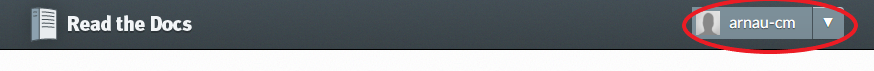
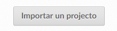
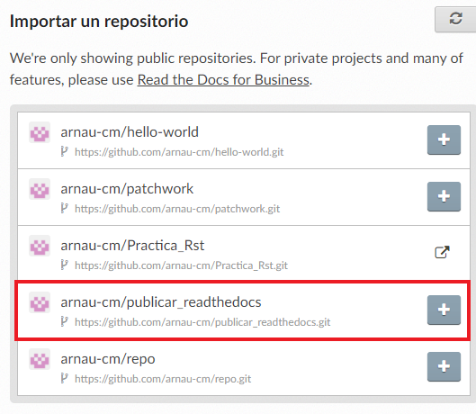
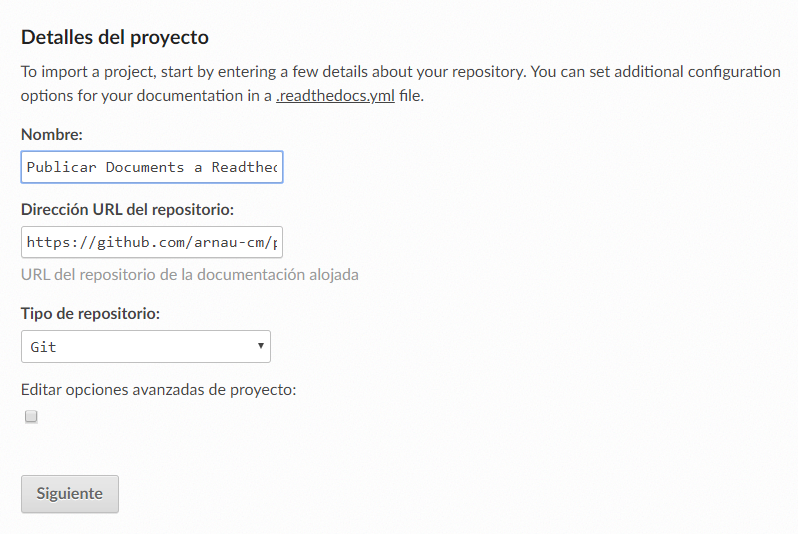
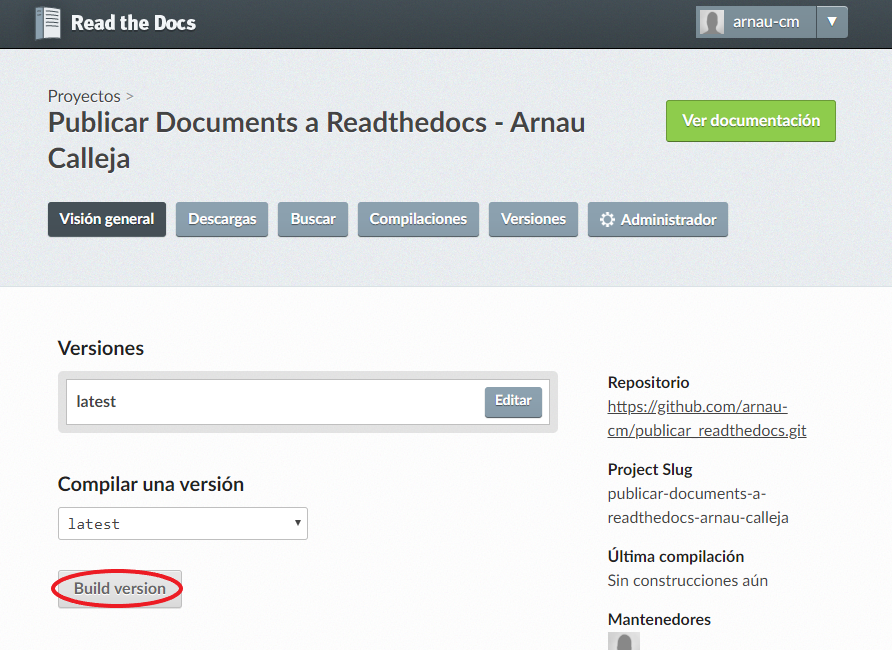
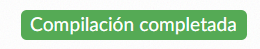
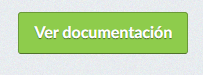
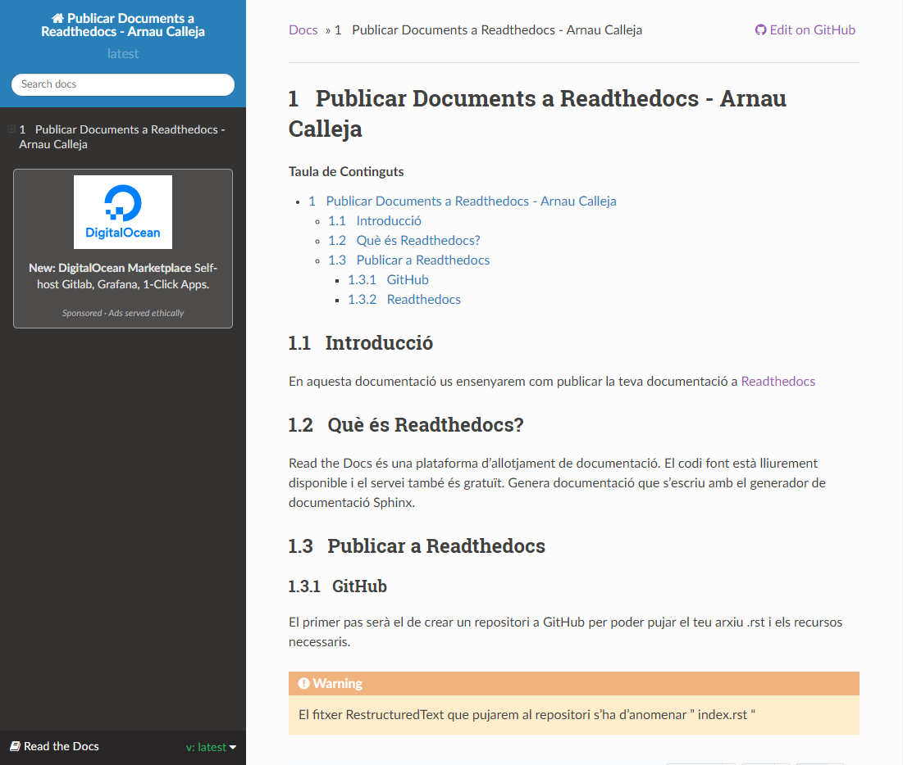

Publicar Documents a Readthedocs
=========================================

.. sectnum::

.. contents:: Taula de Continguts

Introducció
~~~~~~~~~~~~~~~~~~~~~~~~~

En aquesta documentació us ensenyarem com publicar la teva documentació a `Readthedocs <https://readthedocs.org/>`_

Què és Readthedocs?
~~~~~~~~~~~~~~~~~~~~~~~~~

Read the Docs és una plataforma d'allotjament de documentació. El codi font està lliurement disponible i el servei també és gratuït. Genera documentació que s'escriu amb el generador de documentació Sphinx.

Publicar a Readthedocs
~~~~~~~~~~~~~~~~~~~~~~~~~

GitHub
-------------------------------- 

El primer pas serà el de crear un repositori a GitHub per poder pujar el teu arxiu .rst i els recursos necessaris.

.. warning::
    El fitxer RestructuredText que pujarem al repositori s'ha d'anomenar **index.rst**

.. note::
    GitHub et proporciona una "preview" de com quedaria la teva pàgina en la versió actual penjada al teu repositori.

Per poder veure el preview el que has de fer és anar al teu repositori i donar-li clic al teu fitxer .rst, i un cop dins podràs veure com està el teu document.
    

Readthedocs
-------------------------------- 

El primer que haurem de fer és anar al nostre perfil

Un cop en el nostre perfil, li donem clic al botó d' "Importar un proyecto"

I llavors seleccionem el repositori el qual està la nostra documentació que volem penjar, en el nostre cas és el repositori següent: publicar_readthedocs

Un cop seleccionat el repositori, ens sortirà la pantalla de "Detalles del proyecto", i l'únic que canviarem és el nom, que serà el títol del projecte a Readthedocs. Sempre que ho vulguem fer.

Un cop clicat a "Siguiente", ens sortirà la pàgina del projecte, i tal com està sense canviar res li donem a Build Version

Després començarà la "construcció del projecte" i al cap d'un temps la compilació estarà completada.

Llavors ja podrem donar clic a Ver Documentación

I finalment podrem gaudir de la nostra documentació penjada a Readthedocs!

